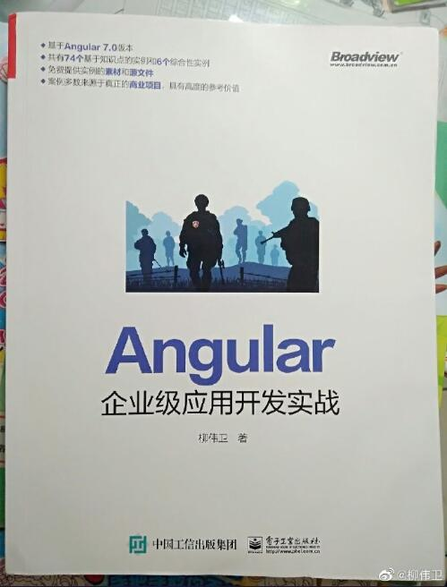

# 《Angular企业级应用开发实战》示例源码

前端组件化开发是目前主流的开发方式，不管是 Angular、React 还是 Vue.js 都如此。相比 较而言，Angular 不管是其开发功能，还是编程思想，在所有前端框架中都是首屈一指的，特别
适合企业级应用的开发。 笔者从 2014 年开始关注 Angular 的技术发展，并用 Angular 1.x 开发实际的企业级应用。那 时，Angular 还只是实现数据双向绑定的 JS 小框架（所以被叫作 AngularJS）。如今，Angular
已经是 7.0 版本，形成了从开发到部署、从 PC 端到移动端完整流程全覆盖的开放平台。因此， 当 Angular 发布 7.0 版本时，笔者便迫不及待地想把这项技术介绍给读者，希望读者能够掌握
Angular 的使用，以简化企业级应用的开发。

本书涉及的相关技术及版本如下。

* VSCodeUserSetup-x64-1.26.1
* Angular 7.1.0
* Angular CLI 7.0.7
* Node.js 10.9.0
* npm 6.2.0

## 内容介绍

本书分为 5 篇。

* “第 1 篇 准备”介绍 Angular 的基础概念，并带领读者快速创建一个 Angular 应用，使读者对 Angular 有一个初步的印象。
* “第 2 篇 入门”介绍 TypeScript 基础，并带领读者快速实现一个简易版本的“用户管理”应用。通过对这部分内容的学习，读者可以了解到 Angular 常用的知识点。
* “第 3 篇 进阶”深入讲解了 Angular 的常用知识点。
* “第 4 篇 高阶”深入讲解了 Angular 的高级知识点。
* “第 5 篇 商业实战”带领读者从零开始实现一个完整的企业级新闻头条客户端应用，使读者具备 Angular 企业级应用开发的完整能力。

## 源码

书中所有示例源码，移步至<https://github.com/waylau/angular-enterprise-application-development-samples>  `samples` 目录下

内容如下：

* ch02/hello-world：第一个Angular应用
* ch03/typescript-demos：TypeScript基础案例
* ch04/user-management：用户管理的例子
* ch05/basic-component：数据展示的例子
* ch05/lifecycle：生命周期钩子的例子
* ch05/component-interaction：组件交互方式
* ch05/component-style：使用组件样式的例子
* ch05/dynamic-component：动态加载组件的例子
* ch05/custom-elements：使用自定义元素的例子
* ch07/attribute-directives：使用属性型指令的例子
* ch07/structural-directives：自定义结构型指令 
* ch08/pipes：使用管道的例子
* ch09/animations：使用动画的例子
* ch10/forms：使用表单的例子
* ch10/user-input：获取用户输入的例子
* ch10/form-validation：表单验证的例子
* ch10/reactive-forms：响应式表单的例子
* ch12/customer-app：惰性加载特性模块的例子
* ch13/dependency-injection：依赖注入的例子
* ch14/http-client：HttpClient的例子
* ch15/router：路由器的例子
* ch16/testing：测试的例子
* ch17/i18n：通过i18n工具来实现国际化
* ch17/ngx-translate：通过ngx-translate插件来实现国际化
* ch19/universal：Universal使用的例子
* ch20/service-worker：使用ServiceWorker的例子
* ch21/news-headlines：News Headlines应用骨架
* ch22/news-headlines：News Headlines首页原型
* ch23/news-headlines：News Headlines导航栏
* ch24/news-headlines：News Headlines新闻详情
* ...

## 配套书籍《Angular企业级应用开发实战》

与该源码配套的书籍《Angular企业级应用开发实战》已经出版，内容详见全书[目录](SUMMARY.md)。

本书如有勘误，会在<https://github.com/waylau/angular-enterprise-application-development-samples/issues>>上进行发布。由于笔者能力有限，时间仓促，难免错漏，欢迎读者批评指正。

您也可以上[豆瓣](https://book.douban.com/subject/34450770/)给老卫打Call。

## 如何获取本书

实体店及各大网店有售。据我所知有如下网站供应：

* [京东](https://search.jd.com/Search?keyword=柳伟卫%20Angular企业级应用开发实战&enc=utf-8&wq=柳伟卫%20Angular企业级应用开发实战&pvid=26dca7699970469ba0f6455f689bd4eb)
* [1号店](https://search.yhd.com/c0-0/k%25E6%259F%25B3%25E4%25BC%259F%25E5%258D%25AB%2520Angular%25E4%25BC%2581%25E4%25B8%259A%25E7%25BA%25A7%25E5%25BA%2594%25E7%2594%25A8%25E5%25BC%2580%25E5%258F%2591%25E5%25AE%259E%25E6%2588%2598/)
* [淘宝](https://s.taobao.com/search?q=柳伟卫+Angular企业级应用开发实战&imgfile=&commend=all&ssid=s5-e&search_type=item&sourceId=tb.index&spm=a21bo.2017.201856-taobao-item.1&ie=utf8&initiative_id=tbindexz_20170306)
* [当当](http://search.dangdang.com/?key=%C1%F8%CE%B0%CE%C0%20Angular%C6%F3%D2%B5%BC%B6%D3%A6%D3%C3%BF%AA%B7%A2%CA%B5%D5%BD&act=input)
* [亚马逊](https://www.amazon.cn/s?k=柳伟卫+Angular企业级应用开发实战&__mk_zh_CN=亚马逊网站&ref=nb_sb_noss)

也可以直接关注我博客（<https://waylau.com/>）或者我的开源书（<https://waylau.com/books/>）。

## 联系作者

您也可以直接联系我：

* 博客：https://waylau.com
* 邮箱：[waylau521(at)gmail.com](mailto:waylau521@gmail.com)
* 微博：http://weibo.com/waylau521
* 开源：https://github.com/waylau

## 其他书籍

若您对本书不感冒，笔者还写了其他方面的超过一打的书籍（可见<https://waylau.com/books/>），多是开源电子书。

本人也维护了一个[books-collection](https://github.com/waylau/books-collection)项目，里面提供了优质的专门给程序员的开源、免费图书集合。

## 开源捐赠

捐赠所得所有款项将用于开源事业！见[捐赠列表](https://waylau.com/donate/)。
